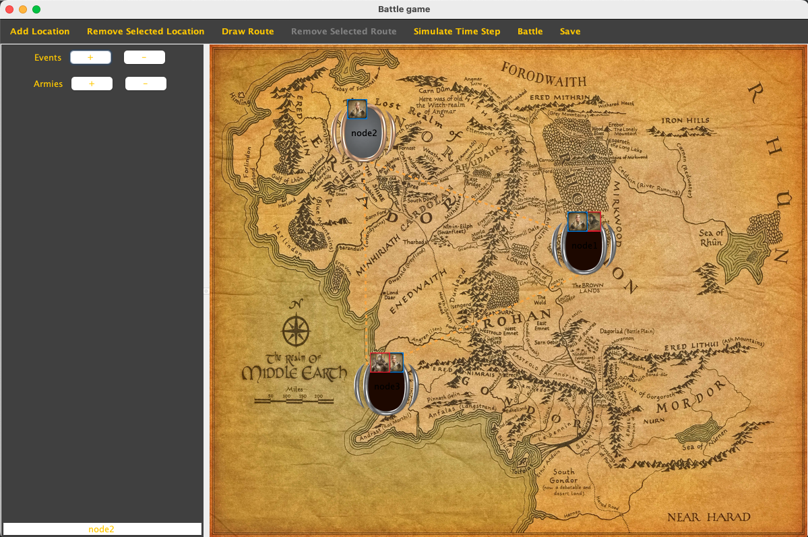

# Battle Simulator

The Battle Simulator program facilitates a battle simulation game, presenting a user-interactive map.

## Features

- **Node Management:** Add or remove nodes on the map.
- **Edge Management:** Establish or remove edges between nodes.
- **Army Management:** Add or remove various armies at the nodes.
- **Node Renaming:** Rename nodes using a text field in the bottom left corner.
- **Battle Simulation:** Simulate battles at the edges or nodes between armies from different teams.
- **Army Commands:** Command armies to progress towards random edges and initiate fights.
- **Save State:** Option to save the current state of the graph in a JSON format using a 'Save' button.

These armies are faction-affiliated and can experience different types of events at the nodes or edges.

## Installation

### Prerequisites

- [Java JDK 8 or later](https://www.oracle.com/java/technologies/javase-downloads.html)
- [Maven](https://maven.apache.org/install.html)

### Steps

<pre>
git clone https://github.com/manos02/battle-simulator.git
cd battle-simulator
mvn clean install
</pre>

### Usage

<pre>
mvn exec:java -Dexec.mainClass="com.manosavvides.rts.Main"
</pre>

