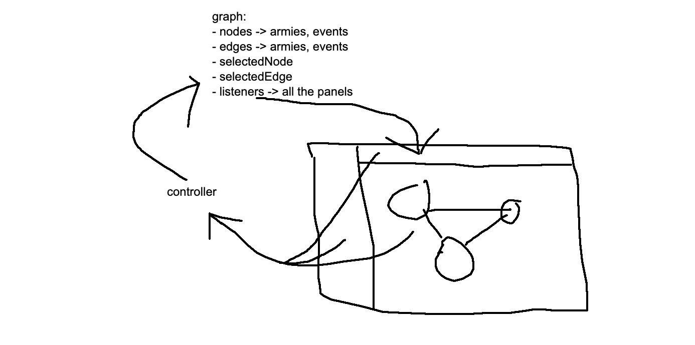

# Report

Manos Savvides (s5106389) & Constantinos Hadjicostis (s5090776)

## Introduction

> *Very briefly describe what your program does.*
>
>Our program facilitates a battle simulation game, presenting a user-interactive map. Users can add or remove nodes on this map, and establish edges between them.
>They also have the option to add or remove various armies at the nodes.
>These armies are faction-affiliated and can experience different types of events at the nodes or edges. Users can also rename any of the nodes using a text field in the bottom
>left corner.
>The game allows users to simulate battles at the edges or nodes, involving armies from differing teams. Additionally,
>users can command the armies to progress towards random edges and subsequently initiate a fight. Finally, the program provides the option to save the current state of the
>graph in a JSON format using a 'Save' button.

## Program design

> *Here you go over the structure of the program. Try not to go too in-depth here implementation-wise, but rather discuss the important components and relations between them. 
> If you think it can help, feel free to add a simple diagram here. The design of the program should be clear to the reader. 
> In particular, describe the model of the program. How is it structured? How did you make sure to separate the different aspects of the program?
> How do the `model`, `view` and `controller` interact with each other?
> Additionally, you should include some design decisions in here. There is no need to provide an explanation for every single thing, 
> but there are often multiple ways of implementing a feature and in those cases it makes sense to state why you chose one over the other.*
>
> 
>
> In our game, the GUI's architecture is built around a central frame into which all other components are added.
> The GraphView class plays a crucial role in this setup, as it's responsible for initializing all frame components and handling their integration.
> One of these integral components is a SplitPanel. This panel manages the display of the primary game elements, which include the map with its nodes and edges.
> It also manages the user options located on the left of the frame, providing the functionality for adding armies or events to nodes and edges.
> Additionally, we have another panel positioned at the top of the frame. This panel houses options for adding or removing nodes and edges, as well as the mechanisms 
> for simulating battles and saving the game state.
> The primary pattern used in our program is the MVC (Model-view-Controller). In general our model changes only when it reacts to an event. The controller tells the model to change
> accordingly from the user input. Lastly when the model updates it notifies the view which is what the user sees. In our program we made sure that the view would never notify
> the model directly which would violate our MVC pattern, resulting difficulties in maintaining the code and implementing more features.
> In our design, the Graph class serves as the primary component for all game-related information, containing all nodes, edges, and the currently selected node or edge.
> This class is also responsible for maintaining and updating all listeners—panels of the game—based on signals received from the controller classes, i.e.,
> user selections from the GUI. To ensure wide-scale information updates, we pass the Graph object to all listener classes. When changes occur, these listeners are notified
> via the Graph's notifyListeners() method. This process leverages a general interface known as Listener. All classes in the view that serve as listeners implement this interface.
> As a result, when the Graph notifies its listeners, the updated() method is invoked for each class implementing the interface. Since each class overrides the interface's
> updated() method, we can customize the response of each component as per our requirements. An alternative approach to implementing this functionality might have involved adding
> listeners to other components, such as nodes and edges. However, we chose to avoid this path as it would have introduced more complexity and reduced the level of code
> abstraction.
> Additionally, another key element of our program is the Simulation class. This class contains the Graph object as a component and has the capability to
> enact the movements of armies across nodes and edges, thereby simulating the progression of armies within the game. Moreover, the Simulation class also keeps track of 
> the state of the game, maintaining a record of the current locations of all armies (at the nodes or at the edges).
> For handling the events we chose to create an abstract class and then all the types of events are separate children classes that inherit from it. In the simulation class we 
> use polymorphism for handling the events, as each child class that inherits from Event parent class overrides the general method of act.
> So the nodes the edges don't know the specific kind of events that they contain but can execute  their specific implementations when event.act(army) is executed. Another way to do that 
> was to have a single class for every event and create different methods inside for each type of event. This would work in our case since we only have 3 type of events, but
> in the future we would not be able to add more type of events, hence our code would not be sustainable. Our chosen approach, on the other hand, supports the addition of more event
> types in the future. Thus, we opted for an architecture that ensures sustainability and flexibility of our codebase, facilitating potential growth and adaptation.

> Expected length: as much as you need to explain the above.

## Evaluation of the program

> *Discuss the stability of your implementation. What works well? Are there any bugs? Is everything tested properly? Are there still features that have not been implemented? Also, if you had the time, what improvements would you make to your implementation? Are there things which you would have done completely differently?*
>
> Indeed, our application functions robustly, and we successfully achieved all initially planned features. The program is thoroughly tested,
> capable of handling both typical scenarios and edge cases effectively. One aspect of our application that requires improvement is edge selection.
> Currently, edge selection is enabled by two constraints: The mouse click must occur between the x and y coordinates of the nodes, and the distance
> from the perpendicular point of the edge must meet a certain threshold. Despite these conditions, we observed occasional inconsistencies in edge selection.
> We suspect that the root of this issue lies within the coordinates of the edge endpoints, which is an area we aim to refine going forward.
> Another successful feature implementation includes the ability to save to JSON. Users can conveniently select an existing file or create a new one to save
> the state of the graph.
> We designed our program in a way that is able to add more things in the future to improve the user experience and add more cool stuff to our game.
> These include adding a variety of new event types, creating armies with unique abilities, and enhancing the immersive quality of our game
> with auditory features like sound effects and background music.
> An additional constraint within our current implementation is that the game window lacks resize functionality. While this does not directly impact the gameplay,
> it may affect the overall user experience as it limits adaptability to different screen sizes and user preferences.
> In addition, our current implementation presents a potential efficiency concern due to the way user selections are handled. As it stands,
> each time a user makes a selection—like adding a new node—the entire screen is cleared and redrawn. This process includes redrawing
> all pre-existing nodes, not just the newly added one. In scenarios where the game state consists of numerous nodes, this approach could significantly
> impact the performance and responsiveness of our application. If we were to revisit this project, we would reconsider this design choice and likely shift
> towards an implementation where only changes, such as new or modified nodes, trigger a partial redraw.
> Despite these areas for improvement, we are largely satisfied with our application's
> overall structure and design. We employed the MVC (Model-View-Controller) pattern, providing a clear separation of concerns among the different parts of our program.
> This not only eases maintenance but also promotes scalability and flexibility, as each part can be modified or extended independently.

>Expected length: ~300-500 words

## Questions

Please answer the following questions:

1. In this assignment, the program should follow the Model View Controller (MVC) pattern. Please explain the design of the program in terms of the MVC pattern. Specifically try to answer the following questions:
   - MVC consists of three components: Model, view and controller. Can you please explain the role of each component? Please provide examples of these roles from the assignment. How are these three roles (i.e. Model, view and controller) are implemented in the assignment?
   - MVC enforces special constraints on the dependencies between its three components: Model, view and controller. Please explain these constraints, and why are they important?

___

Answer:

The Model in our implementation embodies the core logic and data of the program. It operates independently of the user interface, ensuring that our game
logic remains intact irrespective of any UI changes. In our game, the model contains the Graph, containing all nodes and edges, and several additional
classes responsible for various gameplay functionalities.

The Controller acts as the intermediary between the Model and the View. Whenever there's an interaction in the View, such as a button press, the Controller is tasked
to pass this information to the model. Each Controller class is linked to a specific UI component and is triggered when that component is activated.
In our game, all buttons are tied to a specific Controller class, enabling them to signal the Model about any user-triggered changes. It also keeps track of the mouse movements.

The View is tasked with rendering the game's user interface and updating it in response to changes in the Model.
In other words, any changes in the Model's state are reflected in the View, ensuring that the user is always presented with the most current game state.
All classes within our View component contribute to what the user sees within the game's frame (frame, panels, buttons).

About the dependencies:
The Model is completely independent and doesn't have any dependencies on the View or Controller. This is crucial as it allows the Model to be tested and modified
independently, promoting robustness and scalability of the application.

The View depends on the Model, but not the Controller. This enables the View to reactively update itself based on changes in the Model while remaining decoupled from
the Controller.

The Controller depends on the View and is responsible for informing the model about the changes. So
it has a relation with both the view and the model.

___

2. The Swing library provides the ability to create nested user interface components. In this assignment, you created multiple JPanel components on the user interface. These contain other user interface components to build-up a tree of user interface components.
Which design pattern does Swing implement to create a hierarchy of user interface components? Please explain this pattern and how it is implemented in Swing.

___

Answer:

The design pattern that Swing implements to create a hierarchy of user interface components is th Composite design pattern.
This pattern allows you to compose objects into (tree) structures to represent hierarchies and also gives the possibility for other clients 
to treat single individual objects and compositions of objects uniformly.

In Swing the composite of objects is the JPanel class while other UI components such like labels buttons or text fields act as leaf nodes. The way that the Composite pattern is being implemented in Swing is this :

First the component class acts as the common interface for all user components. It defines methods and properties which both individual UI components and JPanel share (leaf nodes and composites).
So creating the actual Hierarchy is like building a tree-like structure of user interfaces by nesting JPanels with each other. Each JPanel has the ability to have other components even other JPanels which means creating a hierarchical structure.

___

3. The Observer pattern is useful to implement the MVC pattern. Can you please explain the relationship between the Observer pattern and the MVC pattern?
Please provide an example from the assignment on how the Observer pattern supports implementing the MVC pattern.

___

Answer:

The Model-View-Controller (MVC) pattern and the Observer pattern are very much related and most times are used together to achieve a separation of concerns
and a decoupling of components in a software application. The MVC pattern divides an application into three interconnected components: Model,View,Controller.
The Observer pattern on the other hand has a mechanism for one-to-many dependency relationships between objects so when one object changes its state , all other objects that
are dependent (observers) get notified and updated automatically.

So exactly what the Observer pattern is doing in the context of implementing the MVC pattern is to establish communication between the Model and the View. The model acts as the subject
and the View as the observer. So when the state of the Model changes, it notifies all Views that are registered about the change. Then
the Views update their presentation to reflect the updated Model state. This means that Model and the View decouple which means it allows them to evolve independently and ensuring that changes in one component do not directly
affect the other.

One example from the assignment is when in the Model we have the Node that holds information about name of the node,a list of edges that the node has
,the list of armies ,a list of events and etc. The view is responsible for displaying this information to the user from the GraphPanel while the Controller handles,
user input and updates the Model accordingly. This is when we implement the Observer pattern because the Model (node) ise maintaining a list of registered Views as observers.
When the data of the Model get modified, then it notifies all registered Views about the change.For example when a sure updates the army on a node through the view, the Controller updates the corresponding
Model object (node). Node triggers a notification to all registered Views with each view being an observer they receive the notification and update its presentation re reflect the new army on the node.

## Process evaluation

> *Describe shortly the process that led to the final code and the report. What was easy, what was difficult? Did you make interesting mistakes? What have you learned from this assignment?*
> 
> The process that led us to our final code and the report was quite interesting. It was a roller coaster ride meaning it had its good times and bad.
> First of all at the start we struggled a bit to figure how java swing works and the GUI but soon enough we got the hang of it. The easiest parts where after
> we understood the MVC pattern and how Java swing works with all the things that swing came with.Some interesting mistakes we had were regarding the selecting features
> because it was inconsistent.After that it was a lot more simple to complete because we followed the design pattern strictly
> which helped us out to finish the program. It was a great experience doing this project because first of all it was both our first time
> handling this kind of *graphics* and in general we learned so much about how basic stuff works. 
>

> Expected length: ~150 words

## Conclusions

> *Add a very short summary/concluding remarks here*
>
> Summing up this was a tricky, challenging but yet enjoyable project .We've learned so many things about the design patterns and how things work in java.
> We left some room for improvement but we believe that for future projects we will take it a step further.
> 